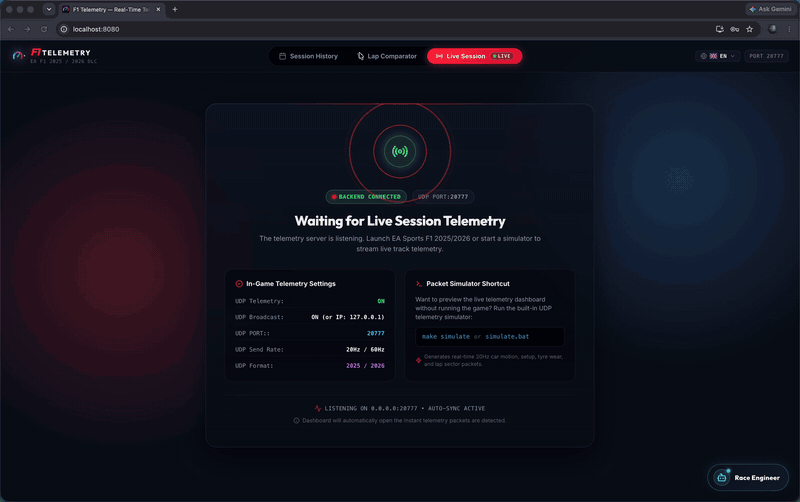

# 🏎️ F1 Telemetry

> High-performance real-time telemetry analyzer, pit wall dashboard, and AI race engineer for **EA Sports F1 25 & F1 26**.

[](https://go.dev/)
[](https://react.dev/)
[](https://vitejs.dev/)
[](LICENSE)



---

## ✨ Key Features

### ⏱️ Live Pit Wall & Race Control Hub
* **Dual View Modes (Race Control vs Voice Cockpit):** Toggle seamlessly between the full 2×2 Race Control Dashboard and a distraction-free **Voice Cockpit Hub** with 0% unneeded widget DOM/Canvas overhead, designed for high-FPS sim racing rigs and VR.
* **Live Incident Feed:** Real-time event ticker tracking overtakes, penalties, fastest laps, pit stops, and Safety Car / VSC deployments with flag indicators.
* **Weather Radar & Tyre Strategy:** Live precipitation forecast (+5m to +30m), air/track temperatures, and tyre compound crossover advice.
* **Live Leaderboard Tower:** Full-grid timing tower with interval deltas, tyre compounds, pit status, and Qualifying elimination cut-off lines.
* **Sector Tracker & Speed Traps:** Live purple/green sector splits, theoretical ultimate best lap record, and top speed rankings.


### 🔍 Telemetry Comparator & Track Map
* **Side-by-Side Analysis:** Compare any two laps (personal bests, rival drivers, or cross-session runs) across Speed, Throttle, Brake, ERS, Gear traces, and 2026 **Active Aero** (`Corner` vs `Straight` mode) & **Boost** deployment.
* **Format-Adaptive Modes:** Automatically adapts ERS Deploy Mode telemetry semantics between F1 2025 (*Overtake*) and F1 2026 (*Boost*).
* **Interactive Track Map:** Sticky circuit visualizer with turn-by-turn badges, racing line synchronization, and real-time hover point readouts.
* **Delta Coaching:** Instant visual gap charts and braking/apex speed difference indicators.

### 📊 Session History & League Management
* **Data Table Explorer & Server-Side Analytics:** Streamlined session repository featuring sortable metadata (Date/Time, Track with High-DPI country flag badges, Type/Format, Duration, Tags, Weather, and Actions), fast filters, and 4-tab session deep-dive powered by server-side analytics endpoints (`/classification`, `/progression`, `/stints`): Official Classification & Penalties, Lap Progression & Gap Charts, Tyre Strategy & Stint Degradation (OLS linear regression slopes), and Ultimate Theoretical Lap & Speed Traps.
* **Batch Operations & Floating Action Dock:** Multi-select sessions via table checkboxes with indeterminate select-all to trigger bulk operations from the floating glassmorphic dock: **Export ZIP** (bundling selected sessions as `.f1session` packages inside a `.zip`), **Batch Deletion**, and **Batch Tag Assignment**.
* **Session Portability & Multi-File Import:** 1-click export of individual sessions (`.f1session`) or bulk ZIP archives (`.zip`), and multi-file drag-and-drop import supporting `.zip` extraction and multiple `.f1session` files with duplicate detection and toast summary reports.
* **Tyre Strategy & Stints Analytics:** Interactive field stint Gantt timeline with hover telemetry stats, pit markers, and tyre degradation & pace curves plotted by tyre age with calculated deg rates (s/lap).
* **Country Flag Visual Identity & Search:** Crisp vector SVG country flags with localized hover tooltips across all views (Session History, Comparator, Live Wall, AI Engineer), with country name and ISO code search support (e.g., searching `Italy`, `ITA`, or `Monza`).
* **Multi-Tag Organization:** Categorize sessions by league (e.g. *WOR*, *AOR*, *PSGL*), tier, or custom wet/dry setups with motorsport color chips and horizontal filter bar.


### 🤖 AI Race Engineer (EN / ES)
* **Real-Time Strategy & Post-Race Debriefs:** Streaming AI debriefs analyzing telemetry deltas, tyre degradation, braking points, and traction pickup.
* **Bilingual Coaching:** Full native support in **English 🇬🇧** and **Español (Latinoamérica) 🇦🇷** using authentic motorsport terminology.
* **LLM Provider Flexibility:** Works out-of-the-box with Google Gemini (default) or OpenAI / custom LLM endpoints (configured directly in UI settings).

### 🎙️ Interactive Voice Race Engineer (Live Sessions)
* **Global Push-to-Talk Radio (In-Game / Background Support):** Talk to your engineer hands-free over live team radio while driving in full-screen mode. The Go backend captures steering wheel buttons (Fanatec, Logitech, Moza, Simagic, etc. via DirectInput) and global keyboard shortcuts at the OS level on Windows. Supports configurable **Hold-to-Talk** (classic F1) and **Toggle On/Off** modes, interactive button learning via web UI, and FOM-style harmonic radio *beeps* on press and release.
* **Driver Call-Sign Personalization:** Set a custom driver name or call-sign (e.g. *Franco*, *Max*, *Chief*) so the pit wall naturally addresses you by name across all voice prompts and live updates.
* **Proactive Pit Wall Watcher & 8 Telemetry Subsystems:** Automatically calls you over the radio without prompting across 8 categorized subsystems with independent per-category cooldowns and instant Emergency Bypass for critical safety events:
  - *Tyre Wear & Overheating:* Granular wear % and critical % sliders, critical puncture bypass (>=95%), and thermal window (>115°C overheat & cold tyre alerts).
  - *Aero & Mechanical Damage:* Front wing flap warning & severe damage (>=40% box) thresholds, floor/diffuser downforce loss %, engine internal component wear %, and DRS/ERS mechanical failures.
  - *ERS & Power Unit:* Low battery reserve % warning and radiator water/oil temp dirty air alerts.
  - *Braking Systems:* Disc fade overheat temp threshold (°C) and cold brake drag warning on formation / SC restarts.
  - *Fuel & Pit Strategy:* Target deficit delta (laps) with Lift & Coast directive, rival undercut threat within gap distance, and pit stop window opening.
  - *Rival Battles & DRS:* Car behind inside DRS zone (<0.8–2.5s) with compound offset and damage notes, and catching car ahead overtake directive.
  - *Qualifying & Shootouts:* Out-lap clean air traffic gap warning (<4s in sector 3), flying lap track limits invalidation, session countdown timer (<3 min), and Q1/Q2 elimination danger zone alerts.
  - *Race Control & Flags:* Full SC, Virtual Safety Car, Red Flag session halts, weather radar rain horizon & probability thresholds, corner cutting warnings before penalty count, and steward penalties.
* **Quick Style Presets & Granular Controls:** Switch instantly between *Inmersivo F1*, *Coaching Pro*, *Mínimo*, or *Personalizado*, with a 1-click Reset to Defaults button and individual audio test preview buttons for every single subsystem.
* **Smart Driving Discretion:** Suppresses non-critical pit wall calls during heavy braking (>50% brake pressure) or mid-corner apex steering (`|Steer| > 0.45`), holding messages until the driver reaches the straight line.
* **Audio Realism & Zero-Latency Caching:** Speech rate (-20% to +30%) and vocal pitch modulation sliders, analog cockpit static & squelch background FX, and instant in-memory audio caching for frequent pit wall radio calls.
* **Engineer Personas & Language-Filtered Neural Voices:** Choose between **Bono 🇬🇧**, **Franco Colapinto 🇦🇷**, or a fully **Custom** persona. Each persona has language-specific neural TTS voices (Spanish: *Tomás*, *Jorge*, *Álvaro*; English: *Ryan*, *Guy*) — the voice dropdown filters automatically to match the selected radio language.
* **4-Tab Glassmorphic Settings Dialog & Master Toggle:** Comprehensive modal organizing settings into *Persona & Driver*, *Voice & Audio Realism*, *Proactive Triggers & Discretion*, and *Tactical Coaching (8 Accordion Subsystems)*. Toggle the radio ON/OFF from settings or via the `⚡ Power` button on the HUD (collapsing into a compact pill and pausing all PTT, mic access, and background calls).

---

## 🚀 Quick Start

### 🏎️ For Gamers & League Racers (Zero Setup Required)

**No programming knowledge, Go, or Node.js required!**

1. Go to **[GitHub Releases](../../releases/latest)** and download the archive for your operating system:
   * **Windows:** `f1telemetry_vX.X.X_windows_amd64.zip` (or `windows_arm64.zip`)
   * **macOS:** `f1telemetry_vX.X.X_darwin_arm64.zip` (Apple Silicon M1-M4) or `darwin_amd64.zip` (Intel)
   * **Linux:** `f1telemetry_vX.X.X_linux_amd64.tar.gz` (or `linux_arm64.tar.gz`)
2. Extract the archive.
3. **Double-click `f1telemetry.exe`** (or run `./f1telemetry` on Mac/Linux).
4. Your default web browser will automatically open **[http://localhost:8080](http://localhost:8080)** with the full pit wall dashboard ready!

> [!NOTE]
> **First-time launch on Windows / macOS:**
> * **Windows:** Because this is a newly released open-source binary without a commercial code-signing certificate, Windows SmartScreen may show a prompt (*"Windows protected your PC"*). Click **"More info"** → **"Run anyway"**, or right-click `f1telemetry.exe` → **Properties** → check **"Unblock"**.
> * **macOS:** macOS Gatekeeper blocks downloaded unsigned binaries by default. Remove the quarantine flag by running: `xattr -d com.apple.quarantine ./f1telemetry` (or right-click `f1telemetry` in Finder → select **Open**).

---

### 💻 For Developers (Running from Source)

#### Prerequisites
* [Go 1.21+](https://go.dev/dl/)
* [Node.js 18+](https://nodejs.org/)

#### One-Click Standalone Launch (Windows)
```powershell
.\run.bat
```
*Installs dependencies if needed, builds the embedded web assets, compiles, and launches the standalone single-binary application with automatic browser opening.*

#### Single-Binary Embedded Build (All Platforms)
```bash
# Build the complete standalone binary containing embedded web assets:
make build-embedded

# Run the single binary:
./bin/f1telemetry
```

#### Hot-Reload Dev Mode
```bash
# Terminal 1: Backend
make run      # or: go run ./cmd/server

# Terminal 2: Frontend (Hot Reload)
cd frontend && npm install && npm run dev
```

Open **[http://localhost:5173](http://localhost:5173)** in your browser for live Vite development.

---

## 🎮 F1 Game Configuration

To stream telemetry from your game (PC, PlayStation, or Xbox):

1. Open **F1 25** (or **F1 26**) and navigate to **Game Options** → **Settings** → **Telemetry Settings**.
2. Configure the following options:
   * **UDP Telemetry:** `On`
   * **UDP Format:** `2025` *(or `2026` for Season Pack DLC)*
   * **UDP IP Address:** IP address of the machine running this application (`127.0.0.1` if playing on the same PC)
   * **UDP Port:** `20777`
   * **UDP Send Rate:** `20Hz` *(Recommended for optimal storage savings and smooth 60 FPS charts; 60Hz is also fully supported)*

---

## 🧪 Test with Built-in Simulator

You don't need the game open to test and explore the dashboard! Use the built-in UDP telemetry simulator to broadcast synthetic telemetry:

```bash
# Linux / macOS:
make simulate                # Simulate a full Race (default F1 2026, 24-car grid)
make simulate SESSION=quali  # Simulate a Qualifying session
make simulate FORMAT=2025    # Use F1 2025 format (22-car grid)

# Windows:
.\simulate.bat               # Or: go run ./cmd/simulator -session race
```

#### Scenario Flags (for testing the Voice Race Engineer)

Trigger specific in-race situations to test proactive radio alerts without waiting for them to happen naturally:

```bash
go run ./cmd/simulator -scenario wear      # Tyres start at 38.5% → triggers tyre deg alerts quickly
go run ./cmd/simulator -scenario sc        # Deploys a Full Safety Car → tests SC radio call
go run ./cmd/simulator -scenario vsc       # Deploys Virtual Safety Car (VSC)
go run ./cmd/simulator -scenario rain      # Injects rain forecast → tests weather crossover alert
```

---

## ⚙️ Configuration (Optional)

Configure server ports or AI API keys via environment variables (or directly within the in-app AI settings drawer):

| Variable | Description | Default |
|---|---|---|
| `F1T_UDP_ADDR` | UDP telemetry listener address | `0.0.0.0:20777` |
| `F1T_HTTP_ADDR` | Web API & WebSocket server address | `:8080` |
| `GEMINI_API_KEY` | Google Gemini API Key for AI Race Engineer | *(Can be set in UI)* |
| `OPENAI_API_KEY` | OpenAI API Key for AI Race Engineer | *(Can be set in UI)* |

---

## 🤝 Contributing & Release Process

Contributions are welcome! Please check out:
* **[CONTRIBUTING.md](CONTRIBUTING.md)**: Development guidelines and PR workflows.
* **[RELEASE.md](RELEASE.md)**: Release lifecycle, SemVer rules, and automated publishing guide.
* **[CHANGELOG.md](CHANGELOG.md)**: Full release history and notable changes.

---

## ⚠️ Disclaimer

This project is an unofficial, open-source community tool developed for educational, telemetry analysis, and league racing purposes. It is **not** affiliated with, endorsed by, or associated with Electronic Arts Inc., Codemasters, or Formula One World Championship Limited. 

*F1*, *FORMULA ONE*, *FORMULA 1*, *FIA FORMULA ONE WORLD CHAMPIONSHIP*, and related logos and marks are trademarks of Formula One Licensing B.V. All game titles, screenshots, and car data are property of their respective owners.

---

## 📄 License

This project is licensed under the MIT License — see the [LICENSE](LICENSE) file for details.


