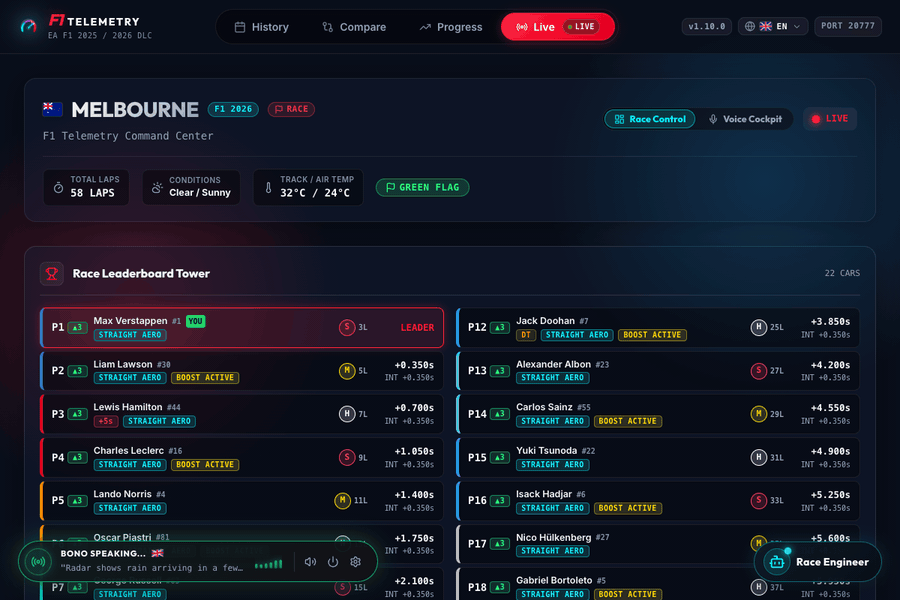

# 🏎️ F1 Telemetry

> High-performance real-time telemetry analyzer, pit wall dashboard, and AI race engineer for **EA Sports F1 25 & F1 26**.

[](https://go.dev/)
[](https://react.dev/)
[](https://vite.dev/)
[](LICENSE)



---

## ✨ Key Features

### ⏱️ Live Pit Wall & Race Control
* **Three View Modes:** Switch between the complete Race Control Hub, a zero-overhead **Voice Cockpit Mode** built for maximum FPS on sim rigs and VR, and a **Driver** view for a phone mounted by the wheel.
* **Driver View for Your Phone (`/live/driver`):** Big, high-contrast numbers with no glow or animation: position, gaps ahead and behind with the race engineer's closing/opening trend, last vs best lap, four-corner tyre wear, fuel, ERS, flags (SC, VSC, yellow, blue) and warnings. Phones open it automatically and it keeps the screen on (Screen Wake Lock, or a muted looping video over plain HTTP; if the browser blocks both it suggests turning off auto-lock).
* **Race Control for a Second Monitor (`/live/dashboard`):** Your car's vitals, a battle panel (the cars ahead and behind, gaps with their per-lap trend, tyres, 2025 DRS or 2026 overtake mode), a track position strip with every car round the lap and the pit lane, and the four hub panels laid out as a grid, one wide row, a race pair (feed + pit strategy) or a timing pair (sectors + feed).
* **Performance Mode:** The gauge button in the top bar switches to solid panels with no glow or animation, for a slow device or a screen read at a glance. It's on by default in the Driver view, which keeps its own setting, and it's saved per device.
* **Live Leaderboard & Timing Tower:** Full-grid timing tower with interval deltas, tyre compounds, pit status, and live Active Aero / Boost indicators. Click any car (in the tower, the battle panel or the strip) for its drawer: gap to the leader, tyres, pit stops, stints and every completed lap with S1/S2/S3 (`GET /api/live/cars/{index}/laps`).
* **Dynamic Weather & Radar:** Live precipitation forecasts (+5m to +30m), track temperature trends, and tyre crossover recommendations.
* **Live Status on Every Page:** The nav's LIVE badge is accurate from any page (the server reports packet age and the active session at `GET /api/system/status`), and a toast offers to open the Live view as soon as a session starts.
* **Real-Time Incidents & Sectors:** Instant race-control ticker tracking overtakes, penalties, safety cars, sector splits (S1, S2 and S3 of completed laps from the game's session history), speed traps, and theoretical best laps in English and Spanish.

### 🔍 Lap Comparator & Track Map
* **Side-by-Side Telemetry:** Compare any two laps across Speed, Throttle, Brake, Gears, ERS, and 2026 Active Aero (`Corner` / `Straight` mode) & Boost traces.
* **Interactive Track Visualizer:** Synchronized circuit map with turn badges, apex speed deltas, and racing line overlays.
* **Where Did I Lose Time:** Per-corner breakdown comparing entry speed, minimum apex speed, braking point, throttle pickup, and time delta across every turn. Clicking a corner zooms the charts and map to that segment (synced to the URL), and **Ask AI** sends that corner directly to the AI Race Engineer.
* **Strip Charts & Card Views:** Switch between individual trace cards and a compact synchronized strip layout with cursor readouts, drag-to-zoom, and customizable trace order and visibility.
* **Quick Start & Server-Side Distance Merging:** One-click comparisons before picking a lap (your best vs. session fastest, vs. your previous session at the circuit, or at another track) backed by a 5m distance-normalized server grid.
* **Automatic Player Reference & Rival Matching:** Slot A automatically selects your car's best lap in the session (falling back to the overall fastest lap), while Slot B automatically matches your chosen comparison target (**Fastest Lap / Leader** with P2 tiebreaker, **Teammate**, or a **Specific Driver**).

### 📊 Session History, Story & Track Progress
* **Session Story & Unified Tab Bar:** Sessions open on the **Story** tab featuring your race summary, clean-lap pace against the field median and leader, a key-moments timeline from the race-control feed, and an on-demand AI debrief. Switch seamlessly across **Classification**, **Pace**, **Positions**, **Gap to Leader**, **Tyres & Stints**, and **Sectors & Speed** with shared driver selection and SC/VSC chart shading.
* **Scalable Session List:** Browse sessions in pages of 50 with collapsible grouping by day, track, or tag, combinable quick filters (*Last 7 days*, *Your results*, *Podiums*, *Places gained*, *No driver*), and savable filter chips. Inside a session, the classification toggles between Gap to Leader and Interval to the car ahead with F1 purple/green/yellow sector indicators.
* **Tyre Degradation on Clean Laps:** Fits each stint's degradation slope and clean average across representative racing laps only—automatically excluding pit in/out laps, SC/VSC laps, and outlier laps above 107% of the stint median (plotted as hollow dots).
* **Your Car in Every Session:** Records the car you drove (`player_car_index`) or lets you pick it afterward—individually via the **Who were you?** dialog or across multiple sessions with **Set my driver…**—powering your results column, Story summary, default chart selections, AI debriefs, and Lap Comparator defaults.
* **Track Progress:** Circuit-by-circuit progression page (`/progress` and `/progress/:track`) tracking your personal best lap, theoretical best from valid sectors, gap to the session fastest lap, and clean-lap consistency trends over time.
* **League & Tag Organization:** Categorize sessions by league (*WOR*, *AOR*, *PSGL*) or setup with custom tags and batch operations (multi-session ZIP export, bulk tagging, and drag-and-drop import with duplicate detection).

### 🎙️ AI Race Engineer & Voice Radio
* **Hands-Free Global Push-to-Talk (PTT):** DirectInput support for steering wheels (Fanatec, Logitech, Moza, Simagic) and global keyboard shortcuts while driving in full-screen.
* **Proactive Pit Wall Calls:** Context-aware pit wall alerts for tyre wear/temperatures, aero damage, ERS deployment, fuel Lift & Coast, rival gaps, and safety cars, with automatic suppression under heavy braking or cornering until you reach the straight.
* **Box Calls That Know Where the Pit Entry Is:** The engineer learns each track's pit entry from the cars that pit (kept between races), so a call to pit says "box this lap" only while you can still make it, "box next lap" when it's too late, and reminds you as the entry comes up. Every call has its own switch, grouped by section, in Settings → Radio calls.
* **Qualifying Like the Pit Wall:** On out-laps and in-laps the engineer warns you of a car behind on a push lap, tells you at the end of the out-lap whether you have traffic or clean air ahead, warns you of a slow car ahead on your push lap and of yellow flags, gives your lap result at the line (position and gap to P1, or provisional pole, and whether you're in the drop zone in Q1/Q2), and calls the session clock and the elimination danger zone once each. Gaps are measured by track position, so they hold even when every car has run a different number of laps.
* **Gap and Tyre Reports:** Every few laps of a race (3 by default, adjustable) the engineer gives your position and the gaps to the cars within 10 seconds ahead and behind, with whether each is closing, opening or stable, said with real numbers in your language. It skips laps under the Safety Car, around your pit stop and right after a battle call. It also tells you how many laps your tyres have left (at about 8 and again at 3), or that they'll make the end.
* **Radio Q&A With the Full Race Picture:** Ask anything over push-to-talk; the engineer tracks live gaps, rival tyres and pit stops, wear rates, fuel targets, pit windows, and weather, and uses function calling to look up deeper lap-by-lap history or standings on demand. Streamed replies begin speaking as soon as the first sentence is synthesized.
* **Neural Voices & Bilingual Personas:** Authentic pit wall personas (**Bono 🇬🇧**, **Franco Colapinto 🇦🇷**, or **Custom**) in **English** and **Español (Latinoamérica)** with cockpit radio filtering, static squelch, and FOM harmonic beeps.
* **Server-Built Context & Rich Markdown Chat:** The server assembles live briefings, post-session debriefs, and zoomed lap comparisons directly from telemetry data, streaming replies formatted with tables, lists, code blocks, and an expandable reading view. On a wide screen the chat can dock beside the page, which makes room for it instead of covering the comparator or your charts.
* **Ask AI About Any Chart:** The session detail's pace, position, gap, degradation and sector charts and the Story tab's key moments each have an **Ask AI** button. The chat always knows which session tab you have open, and the server adds that chart's data (lap-by-lap times and gaps, every stint's degradation, sector times) to what the engineer reads.
* **Per-Provider AI Settings:** Choose **Google Gemini**, **OpenAI**, **Anthropic Claude**, or a local/OpenAI-compatible server (with one-click **Ollama**, **LM Studio**, and **Groq** presets) and browse a searchable list of supported chat models.

---

## 🚀 Quick Start

### 📦 Download Standalone Executable (Recommended)

Pre-compiled, self-contained single binaries with the embedded web dashboard are available under **[GitHub Releases](https://github.com/mgauna-ar/f1game-telemetry-go/releases/latest)**. **No runtime dependencies or installations are required** (no Go or Node.js needed to run).

1. Download the archive for your operating system from the **[Latest Release](https://github.com/mgauna-ar/f1game-telemetry-go/releases/latest)**:
   * **Windows (x64):** `f1telemetry_<version>_windows_amd64.zip`
   * **macOS (Apple Silicon M-series):** `f1telemetry_<version>_darwin_arm64.zip`
   * **Linux (x64):** `f1telemetry_<version>_linux_amd64.tar.gz`

   Other platforms (Intel Macs, ARM Linux) aren't published as binaries: build from source with `make build-embedded`. Windows on ARM runs the x64 build.
2. Extract the archive contents.
3. Run `f1telemetry.exe` (Windows) or `./f1telemetry` (macOS / Linux). A small **app window** opens: whether the game is sending telemetry, the dashboard's address on this PC and for a phone or tablet, what to enter in the game, and an **Open dashboard** button. It's a Chrome, Edge, Chromium or Brave window without tabs (Edge comes with Windows; without one of these it opens as a tab in your default browser). On macOS it opens in your own browser profile, so the browser stays the one you're signed in to. Closing it keeps the app running: on Windows in the tray, on macOS / Linux in its terminal (stop it with Ctrl+C or the window's **Quit** button). Turn off **Show this window at startup** in it to start straight to the tray or terminal. Starting it again while it's already running does nothing. Every page has its own address you can bookmark or share on your network: a session (`/history/12/stints`), a lap comparison with its zoom (`/compare?sa=12&a=345&b=346`), your progress at a track (`/progress/Silverstone`), the live cockpit (`/live/cockpit`) or a settings section (`/settings/comparator`).

#### 🖥️ On Windows: lives in the notification area

There's no console window: the app runs with an icon in the notification area (next to the clock; Windows 11 may first put it under the **^** overflow, and you can drag it out to keep it visible).

* **Left-click** the icon to bring the app window back. **Right-click** for the menu: the live status (*"Live: Race · Monza"* or *"Waiting for the game on UDP port 20777"*), **Show window**, **Open dashboard**, **Open live view**, **Start with Windows**, **Open data folder**, **Open log file** and **Quit**. A notice appears in the menu when a new release is out.
* The icon shows a green dot while the game is sending telemetry.
* **Start with Windows** (in the menu or the app window) starts it in the tray when you sign in, without the window, using the same database.
* The log is written to `f1telemetry.log` next to the database. If the app can't start (for example because another program uses its port), it tells you in a dialog.
* The menu follows your Windows display language (English or Spanish).

> [!NOTE]
> **Windows Defender / SmartScreen Notice:**
> Because this is a free, community open-source project without an expensive commercial code-signing certificate, Windows Defender SmartScreen may display a blue warning (*"Windows protected your PC"* or *"Unknown Publisher"*). This is standard and expected for newly released, unsigned open-source executables.
>
> To proceed: click **"More info"** → **"Run anyway"**. You can also verify binary integrity against the official SHA-256 hashes published in `checksums.txt`, or compile the binary yourself from source.

### 🧪 Development Builds (Without a Release)

Every CI run of a pull request or of `main` builds all three binaries. You can also start one by hand for any branch: **Actions** → **CI/CD Pipeline** → **Run workflow**. Open the run, scroll to **Artifacts**, and download the one for your system (e.g. `f1telemetry-windows-amd64`). They are kept for 14 days. These builds report a `dev-<commit>` version, so they don't offer release updates. On macOS / Linux, make the extracted file executable first (`chmod +x f1telemetry_*`).

---

## 🎮 F1 Game Configuration

To stream telemetry from your game (PC, PlayStation, or Xbox):

1. Open **F1 25** (or **F1 26**) and navigate to **Game Options** → **Settings** → **Telemetry Settings**.
2. Configure the following options:
   * **UDP Telemetry:** `On`
   * **UDP Format:** `2025` *(or `2026` for Season Pack DLC)*
   * **UDP IP Address:** IP address of the machine running this application (`127.0.0.1` if playing on the same PC; the **Live** tab displays your PC's LAN IP addresses with copy buttons for consoles)
   * **UDP Port:** `20777`
   * **UDP Send Rate:** `20Hz` *(Recommended. Saved laps are stored at up to 20 Hz, so a higher rate works but adds nothing to them)*

---

## 🛠️ Building & Development

If you prefer building from source or contributing to the codebase:

### Prerequisites
* [Go 1.26+](https://go.dev/dl/)
* [Node.js 22+](https://nodejs.org/)

### One-Click Standalone Launch (Windows)
```powershell
.\run.bat
```
*Installs frontend dependencies if needed, builds the embedded web assets, compiles, and launches the standalone single-binary application.*

### Single-Binary Embedded Build (All Platforms)
```bash
# Install frontend dependencies (first time only):
cd frontend && npm install && cd ..

# Build the complete standalone binary containing embedded web assets:
make build-embedded

# Run the single binary (or build + run in one step with `make run-embedded`):
./bin/f1telemetry
```

### Hot-Reload Dev Mode
```bash
# Terminal 1: Backend
make dev      # or: go run ./cmd/server

# Terminal 2: Frontend (Hot Reload)
cd frontend && npm install && npm run dev
```

Open **[http://localhost:5173](http://localhost:5173)** in your browser for live Vite development.

### Wire Types (Go → TypeScript)
The frontend's types for server JSON (`frontend/src/types/generated/`) are generated from the Go structs by `cmd/tsgen`. After changing a Go wire type, regenerate them:
```bash
make gen-types   # or: go run ./cmd/tsgen
```
CI runs `go run ./cmd/tsgen -check` and fails when the generated files are out of date.

---

## 🧪 Test with Built-in Simulator

You don't need the game open to test and explore the dashboard! Use the built-in UDP telemetry simulator to broadcast synthetic telemetry:

```bash
# Linux / macOS:
make simulate                # Simulate a full Race (default F1 2026: 22 cars + 2 observers)
make simulate SESSION=quali  # Simulate a Qualifying session
make simulate FORMAT=2025    # Use F1 2025 format (20 cars + 2 observers)

# Windows:
.\simulate.bat               # Or: go run ./cmd/simulator -session race
```

#### Scenario Flags (for testing the Voice Race Engineer)

Trigger specific in-race situations to test proactive radio alerts without waiting for them to happen naturally:

```bash
go run ./cmd/simulator -scenario wear      # Tyres start at 38.5% → triggers tyre deg alerts quickly
go run ./cmd/simulator -scenario sc        # Deploys a Full Safety Car → tests SC radio call
go run ./cmd/simulator -scenario vsc       # Deploys Virtual Safety Car (VSC)
go run ./cmd/simulator -scenario rain      # Injects rain forecast → tests weather crossover alert
go run ./cmd/simulator -scenario start     # Formation lap warmup, grid approach, and lights-out launch reaction debrief
go run ./cmd/simulator -scenario pit       # AI cars pit (pit entry learned), a puncture late on lap 3 → "box next lap", pit entry reminder, then the player's stop: limiter, penalty hold, stop time, exit
go run ./cmd/simulator -scenario qualy     # Q1 runs (out-lap, push lap, in-lap, garage): car behind on a push lap, out-lap traffic / clean air, slow car ahead and a yellow on the push lap, a deleted lap, drop zone and session clock calls
```

---

## ⚙️ Configuration (Optional)

Server settings can be set with command-line flags, environment variables, or a `.env` file (copy `.env.example` to `.env` in the folder you start the app from, or next to the executable). Flags win over environment variables, and real environment variables win over `.env`. The AI variables are defaults: anything saved in the in-app AI settings wins over them.

| Flag | Variable | Description | Default |
|---|---|---|---|
| `-udp` | `F1T_UDP_ADDR` | UDP telemetry listener address | `0.0.0.0:20777` |
| `-http` | `F1T_HTTP_ADDR` | Web API & WebSocket server address | `:8080` |
| `-db` | `F1T_DB_PATH` | SQLite database file (relative paths are resolved from the current folder; the full path is shown at startup) | `f1telemetry.db` |
| `-open-browser` | `F1T_OPEN_BROWSER` | Open the dashboard in the browser on startup (`-no-browser` is still accepted and does nothing) | `false` |
| `-no-tray` | `F1T_NO_TRAY` | Windows: run without the notification-area icon (the release build then has no window at all; stop it from Task Manager) | `false` |
| `-version` | — | Print version, commit, and build date, then exit | `false` |
| | `GEMINI_API_KEY` | Google Gemini API key for the AI Race Engineer | *(Can be set in UI)* |
| | `OPENAI_API_KEY` | OpenAI API key for the AI Race Engineer | *(Can be set in UI)* |
| | `ANTHROPIC_API_KEY` | Anthropic API key for Claude models in the AI Race Engineer | *(Can be set in UI)* |
| | `LLM_PROVIDER` | Default AI provider: `gemini`, `openai`, `claude` or `custom` | First provider with a key, else `gemini` |
| | `LLM_MODEL` | Default model for `LLM_PROVIDER` | Built-in model for the provider |

The database keeps every car's laps, so you can compare yourself with anyone in a session: a 20-car race takes about 6–9 MB. Laps saved by earlier versions take about 7 times more. The first start after updating converts them in the background (about a minute for 1 GB of laps), and the next start gives the space back to the disk. Deleting sessions shrinks the file.

The Live tab shows the UDP port the server listens on and this PC's network addresses (with copy buttons), which is what to enter in the game's telemetry settings on a console. The simulator sends to `127.0.0.1` on the server's `F1T_UDP_ADDR` port. Use `-target` (or `F1T_SIM_TARGET`) to send somewhere else, e.g. `go run ./cmd/simulator -target 192.168.1.20:20777`.

All settings are on one page, opened from the gear in the top bar (`/settings/voice`, `/settings/alerts`, `/settings/ptt`, `/settings/ai`, `/settings/comparator` and `/settings/device`); the radio, AI and comparator dialogs stay as shortcuts with an "All settings" link.

Settings you change in the dashboard are saved in the database, so every device that opens it (the PC, a tablet on your network) shares them: radio alert rules, the AI provider, model and API keys, the engineer's persona and voice, push-to-talk, and who the lap comparator compares you with by default. When one device saves a change, the other open dashboards reload it right away, and if two devices change the radio alert rules at once, the later save is refused and that dashboard shows the newer rules instead of overwriting them. A save that fails shows a notice. Saved API keys are never sent back to a browser; the settings only show that a key is saved. The settings page's "This device" section holds what stays per browser: volume, radio effects, whether the radio speaks on this screen, UI language (the dashboard downloads only the language on screen), units (km/h or mph, °C or °F, a 24- or 12-hour clock; they start from the browser's region and apply to every speed, temperature and clock time, live views included), which live view opens on a computer and on a phone, the Race Control layout, the AI chat window (compact, large, or docked beside the page) and performance mode. The comparator's chart view and strip layout and the session list's grouping and saved filters are per browser too. A comparator rival saved in a browser by an older version moves to the server the first time it opens.

The API only accepts changes from the dashboard the app serves, so other websites open in your browser can't change settings or use your saved keys. Any device that can open the dashboard can still chat using the saved keys, the same as keys set in `.env`. The app window's startup options and Quit (`/api/desktop`) only answer the PC the app runs on, so a phone or tablet on your network can't stop it.

---

## 🤝 Contributing

Contributions are welcome! Please check out **[CONTRIBUTING.md](CONTRIBUTING.md)** for development guidelines and PR workflows, and **[GitHub Releases](https://github.com/mgauna-ar/f1game-telemetry-go/releases)** for release history and changelogs.

---

## ⚠️ Disclaimer

This project is an unofficial, open-source community tool developed for educational, telemetry analysis, and league racing purposes. It is **not** affiliated with, endorsed by, or associated with Electronic Arts Inc., Codemasters, or Formula One World Championship Limited. 

*F1*, *FORMULA ONE*, *FORMULA 1*, *FIA FORMULA ONE WORLD CHAMPIONSHIP*, and related logos and marks are trademarks of Formula One Licensing B.V. All game titles, screenshots, and car data are property of their respective owners.

---

## 📄 License

This project is licensed under the MIT License — see the [LICENSE](LICENSE) file for details.

The dashboard bundles the [Inter](https://github.com/rsms/inter), [Outfit](https://github.com/Outfitio/Outfit-Fonts) and [JetBrains Mono](https://github.com/JetBrains/JetBrainsMono) fonts (via Fontsource), each under the [SIL Open Font License 1.1](https://openfontlicense.org), so it works offline.
